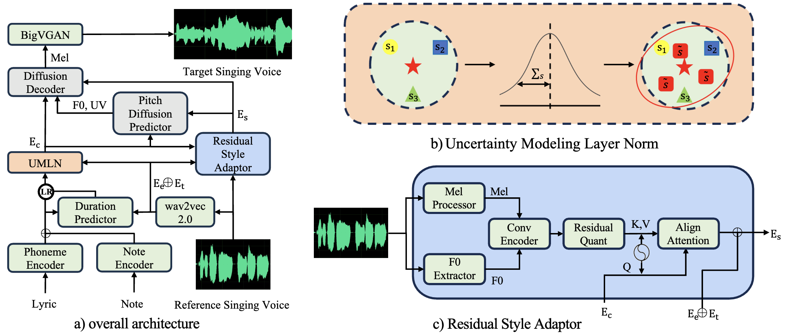

# 📝 Publications 
**denotes co-first authors*

## 🔊 Spatial Audio

    

        

            
ACM-MM 2025

            

        

        

[ISDrama: Immersive Spatial Drama Generation through Multimodal Prompting](https://arxiv.org/abs/2504.20630) \\
**Yu Zhang**, Wenxiang Guo, Changhao Pan, et al.

[**Project**](https://aaronz345.github.io/ISDramaDemo/) \|   
- MRSDrama is the first multimodal recorded spatial drama dataset, containing binaural drama audios, scripts, videos, geometric poses, and textual prompts. 
- ISDrama is the first immersive spatial drama generation model through multimodal prompting.
- Our work is promoted by multiple media and forums, such as , , and
.

- ``ACM-MM 2025`` [A Multimodal Evaluation Framework for Spatial Audio Playback Systems: From Localization to Listener Preference](), Changhao Pan\*, Wenxiang Guo\*, **Yu Zhang\***, et al. 

## 🎼 Music Generation

    

        

            
Preprint

            

        

        

[Versatile Framework for Song Generation with Prompt-based Control](https://arxiv.org/abs/2504.19062) \\
**Yu Zhang**, Wenxiang Guo, Changhao Pan, et al.

[**Project**](https://aaronz345.github.io/VersBandDemo/) 
- VersBand is a multi-task song generation framework for synthesizing high-quality, aligned songs with prompt-based control. 

## 🎙️ Singing Voice Synthesis

    

        

            
ACL 2025

            

        

        

[TCSinger 2: Customizable Multilingual Zero-shot Singing Voice Synthesis](https://arxiv.org/abs/2505.14910) \\
**Yu Zhang**, Ziyue Jiang, Ruiqi Li, et al.

[**Project**](https://aaronz345.github.io/TCSinger2Demo/) \|  
- TCSinger 2 is a multi-task multilingual zero-shot SVS model with style transfer and style control based on various prompts.
- Our work is promoted by multiple media and forums, such as , , and
.

    

        

            
EMNLP 2024

            

        

        

[TCSinger: Zero-Shot Singing Voice Synthesis with Style Transfer and Multi-Level Style Control](https://arxiv.org/abs/2409.15977) \\
**Yu Zhang**, Ziyue Jiang, Ruiqi Li, et al.

[**Project**](https://aaronz345.github.io/TCSingerDemo/) \|  
- TCSinger is the first zero-shot SVS model for style transfer across cross-lingual speech and singing styles, along with multi-level style control. 

    

        

            
NeurIPS 2024 Spotlight

            

        

        

[GTSinger: A Global Multi-Technique Singing Corpus with Realistic Music Scores for All Singing Tasks](https://arxiv.org/abs/2409.13832) \\
**Yu Zhang**, Changhao Pan, Wenxinag Guo, et al.

[**Project**](https://aaronz345.github.io/GTSingerDemo/) \|   

- GTSinger is a large Global, multi-Technique, free-to-use, high-quality singing corpus with realistic music scores, designed for all singing tasks.
- Our work is promoted by multiple media and forums, such as , , and .

    

        

            
AAAI 2024

            

        

        

[StyleSinger: Style Transfer for Out-of-Domain Singing Voice Synthesis](https://arxiv.org/abs/2312.10741) \\
**Yu Zhang**, Rongjie Huang, Ruiqi Li, et al.

[**Project**](https://aaronz345.github.io/StyleSingerDemo/) \| 

- StyleSinger is the first singing voice synthesis model for zero-shot style transfer of out-of-domain reference singing voice samples. 

- `ACL 2025` [STARS: A Unified Framework for Singing Transcription, Alignment, and Refined Style Annotation](https://arxiv.org/abs/2507.06670), Wenxiang Guo\*, **Yu Zhang\***, Changhao Pan\*, et al. \| [**Project**](https://demo-stars.github.io/) \| 
- `AAAI 2025` [TechSinger: Technique Controllable Multilingual Singing Voice Synthesis via Flow Matching](https://arxiv.org/abs/2502.12572), Wenxiang Guo, **Yu Zhang**, Changhao Pan, et al. \| [**Project**](https://tech-singer.github.io/) \| 
- `ACL 2024` [Robust Singing Voice Transcription Serves Synthesis](https://arxiv.org/abs/2405.09940), Ruiqi Li, **Yu Zhang**, Yongqi Wang, et al. \| [**Project**](https://rosvot.github.io/) \| 

## 💬 Speech Synthesis
- ``ASRU 2025`` [Conan: A Chunkwise Online Network for Zero-Shot Adaptive Voice Conversion](https://arxiv.org/abs/2507.14534), **Yu Zhang**, Baotong Tian, Zhiyao Duan. \| [**Project**](https://aaronz345.github.io/ConanDemo/) 
- `Preprint` [MegaTTS 3: Sparse Alignment Enhanced Latent Diffusion Transformer for Zero-Shot Speech Synthesis](https://www.arxiv.org/abs/2502.18924), Ziyue Jiang, Yi Ren, Ruiqi Li, Shengpeng Ji, Zhenhui Ye, Chen Zhang, Bai Jionghao, Xiaoda Yang, Jialong Zuo, **Yu Zhang**, et al.

## 💡 Others
- ``IJCAI 2025`` [Leveraging Pretrained Diffusion Models for Zero-Shot Part Assembly](https://arxiv.org/abs/2505.00426), Ruiyuan Zhang, Qi Wang, Jiaxiang Liu, **Yu Zhang**, et al.
